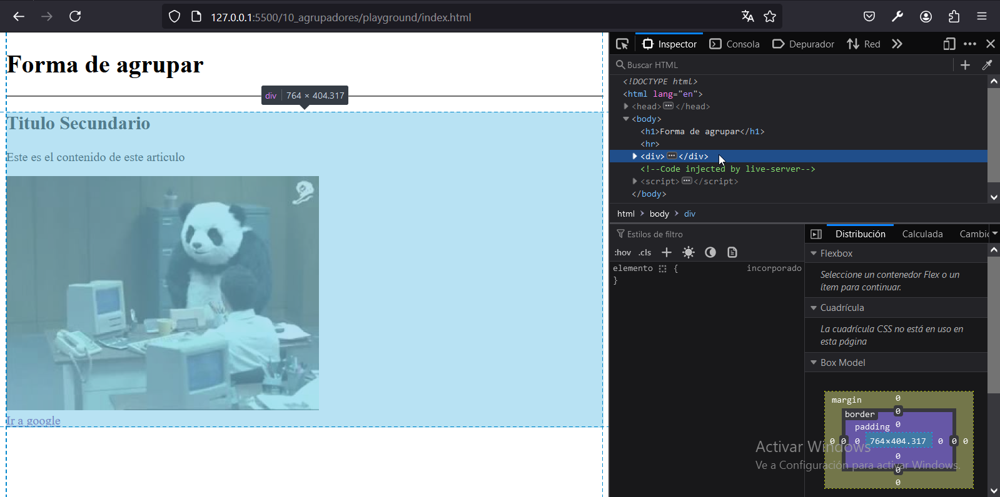
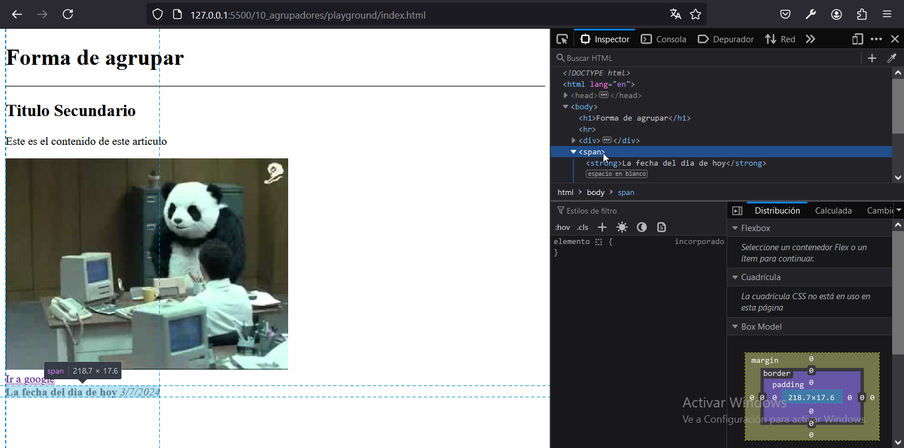

# Capitulo 10: Agrupadores

## Tabla basica

1. Agregar:

```
<h1>
        Forma de agrupar
    </h1>
    <hr>

    <div>
        <h2>Titulo Secundario</h2>
        <p>Este es el contenido de este articulo</p>
        
        <br>
        <a href="https://www.google.com" target="_blank">Ir a google</a>
    </div>

    <span>
        <strong>La fecha del dia de hoy</strong>
        <em>3/7/2024</em>
    </span>
```

2. Presionar `F12` en el navegador o hacer clic derecho primero sobre la pagina web y luego en `Inspeccionar`.

El elemento ```<div></div>``` es un agrupador en bloque.



El elemento ```<span></span>``` es un agrupador en linea.

