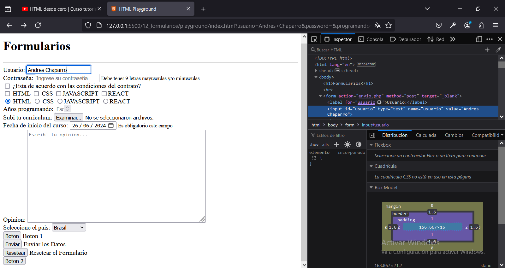

# Capitulo 12: Formularios para ingresar datos que se enviaran y procesaran

## Formulario basico

1. Agregar:

```
    <h1>
        Formularios
    </h1>
    <hr>

    <form>
        <input type="text" id="usuario" name="usuario" value="Andres Chaparro">
        <input type="password" id="password" name="password" placeholder="Ingrese su contraseña">
    </form>
```

El elemento ```<form></form>``` representa al formulario. Luego, cada elemento ```<input>``` es un campo que debemos completar.

El atributo `type` nos permite definir el tipo de dato del campo.

El atributo `id` nos permite identificar al elemento dentro de la pagina web.

El atributo `name` nos permite identificar al campo dentro del formulario.

El atributo `value` nos permite cargar un valor de defecto al campo.

El atributo `placeholder` nos permite mostrarle al usuario un mensaje de sugerencia. Este atributo se usa mucho.

Finalmente, cada elemento ```<label></label>``` se utiliza para colocar una etiqueta de texto que identifique a cada campo.

Es importante que el atributo `for` de la etiqueta debe ser igual al atributo `name` del campo.

## Campos del formulario

1. Agregar:

```
    <h1>
        Formularios
    </h1>
    <hr>

    <form>
        <label for="usuario">Usuario: </label>
        <input type="text" id="usuario" name="usuario" value="Andres Chaparro">
        <br>
        <label for="password">Contraseña: </label>
        <input type="password" id="password" name="password" placeholder="Ingrese su contraseña">
        <br>
        <input type="checkbox" id="condiciones" name="condiciones"> ¿Esta de acuerdo con las condiciones del contrato?
        <br>
        <input type="checkbox" name="lenguajes" value="HTML"> HTML
        <input type="checkbox" name="lenguajes" value="CSS"> CSS
        <input type="checkbox" name="lenguajes" value="JAVASCRIPT">JAVASCRIPT
        <input type="checkbox" name="lenguajes" value="REACT">REACT
        <br>
        <input type="radio" name="lenguajes" value="HTML"> HTML
        <input type="radio" name="lenguajes" value="CSS"> CSS
        <input type="radio" name="lenguajes" value="JAVASCRIPT">JAVASCRIPT
        <input type="radio" name="lenguajes" value="REACT">REACT
        <br>
        <label for="programando">Años programando: </label>
        <input type="number" id="programando" name="programando"placeholder="Escriba el numero de años que lleva programando">
        <br>
        <label for="archivo">Subi tu curriculum: </label>
        <input type="file" id="archivo" name="archivo" value="file">
        <br>
        <label for="fecha">Fecha de inicio del curso: </label>
        <input type="date" id="fecha" name="fecha" max="2024-07-30">
        <br>
        <label for="opinion">Opinion: </label>
        <textarea id="opinion" name="opinion" placeholder="Escribi tu opinion..." rows="15" cols="60"></textarea>
        <br>
        <label for="pais">Seleccione el pais: </label>
        <select name="pais" id="pais">
            <option value="Argentina">Argentina</option>
            <option value="Francia">Francia</option>
            <option value="Brasil" selected="selected">Brasil</option>
            <option value="Inglaterra">Inglaterra</option>
        </select>
    </form>
```

Cada elemento ```<input>```, cuyo `type` sea `checkbox`, nos permitira elegir verdadero o falso. Si varios tienen el mismo valor en el atributo `name`, podremos saber cuales fueron marcados a traves de los atributos `value`.

Cada elemento ```<input>```, cuyo `type` sea `radio`, nos permitira seleccionar una de varias opciones. A este elemento, tambien se lo conoce como *combo*.

Cada elemento ```<input>```, cuyo `type` sea `number`, nos permitira ingresar un numero.

Cada elemento ```<input>```, cuyo `type` sea `file`, nos permitira subir un archivo y el atributo `value` debe valer `file` para que nos muestre el nombre del archivo que subimos en el navegador.

Cada elemento ```<input>```, cuyo `type` sea `date`, nos permitira ingresar una fecha y el atributo `max` nos permite indicar una fecha limite que se puede seleccionar siguiendo el formato `AÑO-MES-DIA`.

El elemento ```<textarea></textarea>``` se utiliza para ingresar un texto muy largo, y con los atributos `rows` y `cols` le indicamos el tamaño que ocupara por defecto.

El elemento ```<select></select>```  nos permitira seleccionar una de varias opciones dentro de un menu desplegable. Luego, cada elemento ```<option></option>``` sera una opcion. Donde el atributo `value` debe tener un valor diferente para cada opcion. Ademas, el atributo `selected` nos permite terner marcada una opcion por defecto. 

Los elementos ```<option></option>``` podran agruparse con elementos ```<optgroup>/<optgroup>``` y con el atributo `label` se le puede colocar una etiqueta de texto, dentro del menu desplegable, a cada grupo.

## Elementos para el envio del formulario

1. Agregar:

```
    <h1>
        Formularios
    </h1>
    <hr>

    <form>
        <label for="usuario">Usuario: </label>
        <input type="text" id="usuario" name="usuario" value="Andres Chaparro">
        <br>
        <label for="password">Contraseña: </label>
        <input type="password" id="password" name="password" placeholder="Ingrese su contraseña">
        <br>
        <input type="checkbox" id="condiciones" name="condiciones"> ¿Esta de acuerdo con las condiciones del contrato?
        <br>
        <input type="checkbox" name="lenguajes" value="HTML"> HTML
        <input type="checkbox" name="lenguajes" value="CSS"> CSS
        <input type="checkbox" name="lenguajes" value="JAVASCRIPT">JAVASCRIPT
        <input type="checkbox" name="lenguajes" value="REACT">REACT
        <br>
        <input type="radio" name="lenguajes" value="HTML"> HTML
        <input type="radio" name="lenguajes" value="CSS"> CSS
        <input type="radio" name="lenguajes" value="JAVASCRIPT">JAVASCRIPT
        <input type="radio" name="lenguajes" value="REACT">REACT
        <br>
        <label for="programando">Años programando: </label>
        <input type="number" id="programando" name="programando"placeholder="Escriba el numero de años que lleva programando">
        <br>
        <label for="archivo">Subi tu curriculum: </label>
        <input type="file" id="archivo" name="archivo" value="file">
        <br>
        <label for="fecha">Fecha de inicio del curso: </label>
        <input type="date" id="fecha" name="fecha" max="2024-07-30">
        <br>
        <label for="opinion">Opinion: </label>
        <textarea id="opinion" name="opinion" placeholder="Escribi tu opinion..." rows="15" cols="60"></textarea>
        <br>
        <label for="pais">Seleccione el pais: </label>
        <select name="pais" id="pais">
            <optgroup label="America">
                <option value="Francia">Francia</option>
                <option value="Inglaterra">Inglaterra</option>
            </optgroup>
            <optgroup label="Europa">
                <option value="Brasil" selected="selected">Brasil</option>
                <option value="Argentina">Argentina</option>
            </optgroup>
        </select>
        <br>
        <input type="button" value="Boton"> Boton
        <br>
        <input type="submit" value="Enviar"> Enviar los Datos
        <br>
        <input type="reset" value="Resetear"> Resetear el Formulario
    </form>
```

Un elemento ```<input>```, cuyo `type` sea `button`, es solamente un boton donde el atributo `onclick` nos permite ejecutar un codigo en lenguaje JAVASCRIPT. Este tema se vera en otro curso.

Un elemento ```<input>```, cuyo `type` sea `submit`, envia el formulario.

Un elemento ```<input>```, cuyo `type` sea `reset`, reestablece los datos del formulario.

Un elemento ````<button></button>```, se comporta de forma similar al `submit` pero ejecutando el codigo que esta en el atributo `onclick` antes de enviar el formulario.

## Atributos del formulario

1. Agregar:

```
    <h1>
        Formularios
    </h1>
    <hr>

    <form action="envio.php" method="post" target="_blank">
        <label for="usuario">Usuario: </label>
        <input type="text" id="usuario" name="usuario" value="Andres Chaparro">
        <br>
        <label for="password">Contraseña: </label>
        <input type="password" id="password" name="password" placeholder="Ingrese su contraseña">
        <br>
        <input type="checkbox" id="condiciones" name="condiciones"> ¿Esta de acuerdo con las condiciones del contrato?
        <br>
        <input type="checkbox" name="lenguajes" value="HTML"> HTML
        <input type="checkbox" name="lenguajes" value="CSS"> CSS
        <input type="checkbox" name="lenguajes" value="JAVASCRIPT">JAVASCRIPT
        <input type="checkbox" name="lenguajes" value="REACT">REACT
        <br>
        <input type="radio" name="lenguajes" value="HTML"> HTML
        <input type="radio" name="lenguajes" value="CSS"> CSS
        <input type="radio" name="lenguajes" value="JAVASCRIPT">JAVASCRIPT
        <input type="radio" name="lenguajes" value="REACT">REACT
        <br>
        <label for="programando">Años programando: </label>
        <input type="number" id="programando" name="programando"placeholder="Escriba el numero de años que lleva programando">
        <br>
        <label for="archivo">Subi tu curriculum: </label>
        <input type="file" id="archivo" name="archivo" value="file">
        <br>
        <label for="fecha">Fecha de inicio del curso: </label>
        <input type="date" id="fecha" name="fecha" max="2024-07-30">
        <br>
        <label for="opinion">Opinion: </label>
        <textarea id="opinion" name="opinion" placeholder="Escribi tu opinion..." rows="15" cols="60"></textarea>
        <br>
        <label for="pais">Seleccione el pais: </label>
        <select name="pais" id="pais">
            <optgroup label="America">
                <option value="Francia">Francia</option>
                <option value="Inglaterra">Inglaterra</option>
            </optgroup>
            <optgroup label="Europa">
                <option value="Brasil" selected="selected">Brasil</option>
                <option value="Argentina">Argentina</option>
            </optgroup>
        </select>
        <br>
        <input type="button" value="Boton" onclick="alert('Hola mundo 1 desde... ya lo vamos a ver!')"> Boton 1
        <br>
        <input type="submit" value="Enviar"> Enviar los Datos
        <br>
        <input type="reset" value="Resetear"> Resetear el Formulario
        <br>
        <button onclick="alert('Hola mundo 2 desde... ya lo vamos a ver!')">Boton 2</button>
    </form>
```

Para verificar el envio del formulario, necesitariamos un backend que procese el formulario y nos envie una respuesta. Este tema se vera en otro curso.

El atributo `action` debe tener una URL del backend, donde se enviara la informacion del formulario.

El atributo `method` indica el verbo del protocolo HTML que se utiliza para enviar el formulario. El mismo es `post` porque el formulario contiene datos sensibles.

El atributo `target` debe tener el valor `_blank` para que el resultado devuelto por el backend, se muestre en una pestaña aparte sin cerrar nuestra pagina web, tal cual se vio con enlaces.

## Atributos avanzados de los campos

1. Agregar:

```
    <h1>
        Formularios
    </h1>
    <hr>

    <form action="envio.php" method="post" target="_blank">
        <label for="usuario">Usuario: </label>
        <input type="text" id="usuario" name="usuario" value="Andres Chaparro" disabled>
        <br>
        <label for="password">Contraseña: </label>
        <input type="password" id="password" name="password" placeholder="Ingrese su contraseña" minlength="6" maxlength="10" pattern="[A-Za-z]{9}">
        <small>Debe tener 9 letras mayusculas y/o minusculas</small>
        <br>
        <input type="checkbox" id="condiciones" name="condiciones"> ¿Esta de acuerdo con las condiciones del contrato?
        <br>
        <input type="checkbox" name="lenguajes" value="HTML"> HTML
        <input type="checkbox" name="lenguajes" value="CSS"> CSS
        <input type="checkbox" name="lenguajes" value="JAVASCRIPT">JAVASCRIPT
        <input type="checkbox" name="lenguajes" value="REACT">REACT
        <br>
        <input type="radio" name="lenguajes" value="HTML" required> HTML
        <input type="radio" name="lenguajes" value="CSS" required> CSS
        <input type="radio" name="lenguajes" value="JAVASCRIPT" required>JAVASCRIPT
        <input type="radio" name="lenguajes" value="REACT" required>REACT
        <br>
        <label for="programando">Años programando: </label>
        <input type="number" id="programando" name="programando"placeholder="Escriba el numero de años que lleva programando" max="5" min="0">
        <br>
        <label for="archivo">Subi tu curriculum: </label>
        <input type="file" id="archivo" name="archivo" value="file" multiple>
        <br>
        <label for="fecha">Fecha de inicio del curso: </label>
        <input type="date" id="fecha" name="fecha" max="2024-07-30" required>
        <small>Es obligatorio este campo</small>
        <br>
        <label for="opinion">Opinion: </label>
        <textarea id="opinion" name="opinion" placeholder="Escribi tu opinion..." rows="15" cols="60"></textarea>
        <br>
        <label for="pais">Seleccione el pais: </label>
        <select name="pais" id="pais">
            <optgroup label="America">
                <option value="Francia">Francia</option>
                <option value="Inglaterra">Inglaterra</option>
            </optgroup>
            <optgroup label="Europa">
                <option value="Brasil" selected="selected">Brasil</option>
                <option value="Argentina">Argentina</option>
            </optgroup>
        </select>
        <br>
        <input type="button" value="Boton" onclick="alert('Hola mundo 1 desde... ya lo vamos a ver!')"> Boton 1
        <br>
        <input type="submit" value="Enviar"> Enviar los Datos
        <br>
        <input type="reset" value="Resetear"> Resetear el Formulario
        <br>
        <button onclick="alert('Hola mundo 2 desde... ya lo vamos a ver!')">Boton 2</button>
    </form>
```

En un elemento ```<input>```, el atributo `readonly` nos permite bloquear el campo para que el usuario no pueda modificarlo.

En un elemento ```<input>```, el atributo `disabled` es similar a `readonly` pero es mas intuitivo visualmente, lo que mejora la experiencia de usuario.

En un elemento ```<input>```, cuyo `type` sea `text`, los atributos `minlength` y `maxlength` se utilizan para limitar el numero de caracteres. En caso de no cumplir con `minlength`, se mostrara un mensaje de error al enviar el formulario. Y en el caso de `maxlength`, no nos permitira ingresar caracteres de mas.

En un elemento ```<input>```, el atributo `pattern`, nos permite utilizar expresiones regulares para evaluar patrones de texto. En este caso, la idea es que se deban ingresar 9 letras ya sea en mayuscula o minuscula. Y en caso de no respetar el patron, se mostrara un mensaje de error al enviar el formulario. Cuando necesitemos utilizar expresiones regulares, conviene buscarlas en internet.

En un elemento ```<input>```, cuyo `type` sea `number`, los atributos `min` y `max` se utilizan para limitar el numero que se pueden ingresar. Por ejemplo, podemos evitar que el usuario ingrese numeros negativos. Y en caso de ingresar valores fuera de rango por medio del teclado, se mostrara un mensaje de error al enviar el formulario.

En un elemento ```<input>```, cuyo `type` sea `file`, se puede agregar el atributo `multiple` para poder subir mas de un archivo.

El atributo `required` indica que es obligatorio completar el campo para poder enviar el formulario. Si no se lo completa, se mostrara un mensaje de error al enviar el formulario.

Las validaciones deben hacer tanto con un framework front-end y como en el backend. Esto se debe a que nuestra pagina se puede hackear facilmente utilizando el inspector del explorador.



## Campo email

1. Agregar:

```
    <h1>
        Formularios
    </h1>
    <hr>

    <form action="envio.php" method="post" target="_blank">
        <label for="usuario">Usuario: </label>
        <input type="text" id="usuario" name="usuario" value="Andres Chaparro" disabled>
        <br>
        <label for="password">Contraseña: </label>
        <input type="password" id="password" name="password" placeholder="Ingrese su contraseña" minlength="6" maxlength="10" pattern="[A-Za-z]{9}">
        <small>Debe tener 9 letras mayusculas y/o minusculas</small>
        <br>
        <input type="checkbox" id="condiciones" name="condiciones"> ¿Esta de acuerdo con las condiciones del contrato?
        <br>
        <input type="checkbox" name="lenguajes" value="HTML"> HTML
        <input type="checkbox" name="lenguajes" value="CSS"> CSS
        <input type="checkbox" name="lenguajes" value="JAVASCRIPT">JAVASCRIPT
        <input type="checkbox" name="lenguajes" value="REACT">REACT
        <br>
        <input type="radio" name="lenguajes" value="HTML" required> HTML
        <input type="radio" name="lenguajes" value="CSS" required> CSS
        <input type="radio" name="lenguajes" value="JAVASCRIPT" required>JAVASCRIPT
        <input type="radio" name="lenguajes" value="REACT" required>REACT
        <br>
        <label for="programando">Años programando: </label>
        <input type="number" id="programando" name="programando"placeholder="Escriba el numero de años que lleva programando" max="5" min="0">
        <br>
        <label for="archivo">Subi tu curriculum: </label>
        <input type="file" id="archivo" name="archivo" value="file" multiple>
        <br>
        <label for="fecha">Fecha de inicio del curso: </label>
        <input type="date" id="fecha" name="fecha" max="2024-07-30" required>
        <small>Es obligatorio este campo</small>
        <br>
        <label for="opinion">Opinion: </label>
        <textarea id="opinion" name="opinion" placeholder="Escribi tu opinion..." rows="15" cols="60"></textarea>
        <br>
        <label for="pais">Seleccione el pais: </label>
        <select name="pais" id="pais">
            <optgroup label="America">
                <option value="Francia">Francia</option>
                <option value="Inglaterra">Inglaterra</option>
            </optgroup>
            <optgroup label="Europa">
                <option value="Brasil" selected="selected">Brasil</option>
                <option value="Argentina">Argentina</option>
            </optgroup>
        </select>
        <br>
        <input type="button" value="Boton" onclick="alert('Hola mundo 1 desde... ya lo vamos a ver!')"> Boton 1
        <br>
        <input type="submit" value="Enviar"> Enviar los Datos
        <br>
        <input type="reset" value="Resetear"> Resetear el Formulario
        <br>
        <button onclick="alert('Hola mundo 2 desde... ya lo vamos a ver!')">Boton 2</button>
        <br>
        <label for="mail">Mail: </label>
        <input type="email" id="mail" name="mail" placeholder="Ingresa tu mail" required>
    </form>
```

Un elemento ```<input>```, cuyo `type` sea `email`, esta preparado para verificar que el texto ingresado tenga el patron `algo@sitio.com`.
