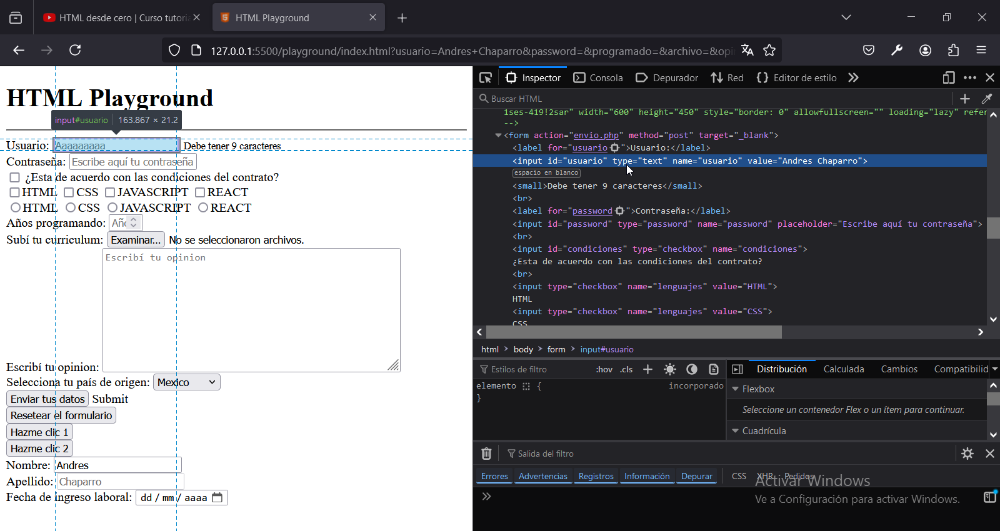

# Capitulo 12: Formularios

## Crear un formulario con un campo del tipo texto

1. Agregar:

```
    <form>
      <label for="usuario">Usuario: </label>
      <input type="text" id="usuario" name="usuario" value="Andres Chaparro" />
    </form>
```

- El elemento `<form></form>`nos permite crear el formulario.
- Los elementos `<input />` nos permiten crear campos en el formulario.
- Los elementos `<label></label>` nos permiten agregarle una etiqueta de texto a los campos para poder identificarlos.

Todos los elementos tienen el siguiente atributo:

- El atributo `id` nos permite identificar un elemento dentro de la pagina web.

Los campos tienen los siguientes atributos:

- El atributo `type` nos permite definir el tipo de campo.
- El atributo `name` nos permite identificar un campo dentro del formulario.
- El atributo `value` nos permite cargarle un valor por defecto al campo.

Las etiquetas de texto tienen el siguiente atributo:

- El atributo `for` debe tener el mismo valor que el atributo `name` del campo.

## Crear un campo del tipo contraseña

1. Modificar el código:

```
    <form>
      <label for="usuario">Usuario: </label>
      <input type="text" id="usuario" name="usuario" value="Andres Chaparro" />

      <br />
      <label for="password">Contraseña: </label>
      <input
        type="password"
        id="password"
        name="password"
        placeholder="Escribe aquí tu contraseña"
      />
    </form>
```

- El atributo `placeholder` nos permite mostrarle al usuario un mensaje para ayudarlo a completar el campo.

No se pueden utilizar los atributos `value` y `placeholder` al mismo tiempo.

## Crear un campo del tipo checkbox

1. Modificar el código:

```
    <form>
      <label for="usuario">Usuario: </label>
      <input type="text" id="usuario" name="usuario" value="Andres Chaparro" />

      <br />
      <label for="password">Contraseña: </label>
      <input
        type="password"
        id="password"
        name="password"
        placeholder="Escribe aquí tu contraseña"
      />

      <br />
      <input type="checkbox" id="condiciones" name="condiciones" /> ¿Esta de
      acuerdo con las condiciones del contrato?
    </form>
```

## Crear varios campos del tipo checkbox para hacer una selección multiple

1. Modificar el código:

```
    <form>
      <label for="usuario">Usuario: </label>
      <input type="text" id="usuario" name="usuario" value="Andres Chaparro" />

      <br />
      <label for="password">Contraseña: </label>
      <input
        type="password"
        id="password"
            name="password"
        placeholder="Escribe aquí tu contraseña"
      />

      <br />
      <input type="checkbox" id="condiciones" name="condiciones" /> ¿Esta de
      acuerdo con las condiciones del contrato?

      <br />
      <input type="checkbox" name="lenguajes" value="HTML" />HTML
      <input type="checkbox" name="lenguajes" value="CSS" />CSS
      <input type="checkbox" name="lenguajes" value="JAVASCRIPT" />JAVASCRIPT
      <input type="checkbox" name="lenguajes" value="REACT" />REACT
    </form>
```

## Crear varios campos del tipo radio para seleccionar una única opción

1. Modificar el código:

```
    <form>
      <label for="usuario">Usuario: </label>
      <input type="text" id="usuario" name="usuario" value="Andres Chaparro" />

      <br />
      <label for="password">Contraseña: </label>
      <input
        type="password"
        id="password"
        name="password"
        placeholder="Escribe aquí tu contraseña"
      />

      <br />
      <input type="checkbox" id="condiciones" name="condiciones" /> ¿Esta de
      acuerdo con las condiciones del contrato?

      <br />
      <input type="checkbox" name="lenguajes" value="HTML" />HTML
      <input type="checkbox" name="lenguajes" value="CSS" />CSS
      <input type="checkbox" name="lenguajes" value="JAVASCRIPT" />JAVASCRIPT
      <input type="checkbox" name="lenguajes" value="REACT" />REACT

      <br />
      <input type="radio" name="lenguajes" value="HTML" />HTML
      <input type="radio" name="lenguajes" value="CSS" />CSS
      <input type="radio" name="lenguajes" value="JAVASCRIPT" />JAVASCRIPT
      <input type="radio" name="lenguajes" value="REACT" />REACT
    </form>
```

## Crear un campo del tipo numérico

1. Modificar el código:

```
    <form>
      <label for="usuario">Usuario: </label>
      <input type="text" id="usuario" name="usuario" value="Andres Chaparro" />

      <br />
      <label for="password">Contraseña: </label>
      <input
        type="password"
        id="password"
        name="password"
        placeholder="Escribe aquí tu contraseña"
      />

      <br />
      <input type="checkbox" id="condiciones" name="condiciones" /> ¿Esta de
      acuerdo con las condiciones del contrato?

      <br />
      <input type="checkbox" name="lenguajes" value="HTML" />HTML
      <input type="checkbox" name="lenguajes" value="CSS" />CSS
      <input type="checkbox" name="lenguajes" value="JAVASCRIPT" />JAVASCRIPT
      <input type="checkbox" name="lenguajes" value="REACT" />REACT

      <br />
      <input type="radio" name="lenguajes" value="HTML" />HTML
      <input type="radio" name="lenguajes" value="CSS" />CSS
      <input type="radio" name="lenguajes" value="JAVASCRIPT" />JAVASCRIPT
      <input type="radio" name="lenguajes" value="REACT" />REACT

      <br />
      <label for="programado">Años programando: </label>
      <input
        type="number"
        id="programado"
        name="programado"
        placeholder="Años programando"
      />
    </form>
```

## Crear un campo del tipo archivo

1. Modificar el código:

```
    <form>
      <label for="usuario">Usuario: </label>
      <input type="text" id="usuario" name="usuario" value="Andres Chaparro" />

      <br />
      <label for="password">Contraseña: </label>
      <input
        type="password"
        id="password"
        name="password"
        placeholder="Escribe aquí tu contraseña"
      />

      <br />
      <input type="checkbox" id="condiciones" name="condiciones" /> ¿Esta de
      acuerdo con las condiciones del contrato?

      <br />
      <input type="checkbox" name="lenguajes" value="HTML" />HTML
      <input type="checkbox" name="lenguajes" value="CSS" />CSS
      <input type="checkbox" name="lenguajes" value="JAVASCRIPT" />JAVASCRIPT
      <input type="checkbox" name="lenguajes" value="REACT" />REACT

      <br />
      <input type="radio" name="lenguajes" value="HTML" />HTML
      <input type="radio" name="lenguajes" value="CSS" />CSS
      <input type="radio" name="lenguajes" value="JAVASCRIPT" />JAVASCRIPT
      <input type="radio" name="lenguajes" value="REACT" />REACT

      <br />
      <label for="programado">Años programando: </label>
      <input
        type="number"
        id="programado"
        name="programado"
        placeholder="Años programando"
      />

      <br />
      <label for="archivo">Subí tu curriculum: </label>
      <input type="file" id="archivo" name="archivo" value="file" multiple />
    </form>
```

- Cuando el atributo `value` vale `file` nos permite obtener el nombre del archivo que subimos.
- El atributo `multiple` nos permite subir mas de un archivo.

## Crear un campo del tipo textarea para ingresar un texto largo

1. Modificar el código:

```
    <form>
      <label for="usuario">Usuario: </label>
      <input type="text" id="usuario" name="usuario" value="Andres Chaparro" />

      <br />
      <label for="password">Contraseña: </label>
      <input
        type="password"
        id="password"
        name="password"
        placeholder="Escribe aquí tu contraseña"
      />

      <br />
      <input type="checkbox" id="condiciones" name="condiciones" /> ¿Esta de
      acuerdo con las condiciones del contrato?

      <br />
      <input type="checkbox" name="lenguajes" value="HTML" />HTML
      <input type="checkbox" name="lenguajes" value="CSS" />CSS
      <input type="checkbox" name="lenguajes" value="JAVASCRIPT" />JAVASCRIPT
      <input type="checkbox" name="lenguajes" value="REACT" />REACT

      <br />
      <input type="radio" name="lenguajes" value="HTML" />HTML
      <input type="radio" name="lenguajes" value="CSS" />CSS
      <input type="radio" name="lenguajes" value="JAVASCRIPT" />JAVASCRIPT
      <input type="radio" name="lenguajes" value="REACT" />REACT

      <br />
      <label for="programado">Años programando: </label>
      <input
        type="number"
        id="programado"
        name="programado"
        placeholder="Años programando"
      />

      <br />
      <label for="archivo">Subí tu curriculum: </label>
      <input type="file" id="archivo" name="archivo" value="file" multiple />

      <br />
      <label for="opinion">Escribí tu opinion: </label>
      <textarea
        id="opinion"
        name="opinion"
        placeholder="Escribí tu opinion"
        rows="10"
        cols="50"
      ></textarea>
    </form>
```

- El atributo `rows` nos permite definir el alto inicial del campo.
- El atributo `cols` nos permite definir el ancho inicial del campo.

## Crear un campo del tipo select para marcar una opción de un menu desplegable

1. Modificar el código:

```
    <form>
      <label for="usuario">Usuario: </label>
      <input type="text" id="usuario" name="usuario" value="Andres Chaparro" />

      <br />
      <label for="password">Contraseña: </label>
      <input
        type="password"
        id="password"
        name="password"
        placeholder="Escribe aquí tu contraseña"
      />

      <br />
      <input type="checkbox" id="condiciones" name="condiciones" /> ¿Esta de
      acuerdo con las condiciones del contrato?

      <br />
      <input type="checkbox" name="lenguajes" value="HTML" />HTML
      <input type="checkbox" name="lenguajes" value="CSS" />CSS
      <input type="checkbox" name="lenguajes" value="JAVASCRIPT" />JAVASCRIPT
      <input type="checkbox" name="lenguajes" value="REACT" />REACT

      <br />
      <input type="radio" name="lenguajes" value="HTML" />HTML
      <input type="radio" name="lenguajes" value="CSS" />CSS
      <input type="radio" name="lenguajes" value="JAVASCRIPT" />JAVASCRIPT
      <input type="radio" name="lenguajes" value="REACT" />REACT

      <br />
      <label for="programado">Años programando: </label>
      <input
        type="number"
        id="programado"
        name="programado"
        placeholder="Años programando"
      />

      <br />
      <label for="archivo">Subí tu curriculum: </label>
      <input type="file" id="archivo" name="archivo" value="file" multiple />

      <br />
      <label for="opinion">Escribí tu opinion: </label>
      <textarea
        id="opinion"
        name="opinion"
        placeholder="Escribí tu opinion"
        rows="10"
        cols="50"
      ></textarea>

      <br />
      <label for="pais">Selecciona tu país de origen: </label>
      <select id="pais" name="pais">
        <optgroup label="America">
          <option value="Argentina">Argentina</option>
          <option value="Mexico" selected="selected">Mexico</option>
          <option value="Uruguay">Uruguay</option>
        </optgroup>

        <optgroup label="Europa">
          <option value="Francia">Francia</option>
          <option value="Croacia">Croacia</option>
          <option value="España">España</option>
        </optgroup>
      </select>
    </form>
```

- Los elementos `<optgroup></optgroup>` nos permite separar las opciones en grupos.
- Los elementos `<option></option>` nos permiten crear una opción.

Los grupos tienen el siguiente atributo:

- El atributo `label` nos permite agregarles una etiqueta de texto para poder identificarlos.

Las opciones tienen los siguientes atributos:

- El atributo `value` debe ser diferente para cada opción.
- El atributo `selected` debe valer `selected` en la opción que deseamos que venga marcada por defecto.

## Crear un botón para enviar el formulario

1. Modificar el código:

```
    <form>
      <label for="usuario">Usuario: </label>
      <input type="text" id="usuario" name="usuario" value="Andres Chaparro" />

      <br />
      <label for="password">Contraseña: </label>
      <input
        type="password"
        id="password"
        name="password"
        placeholder="Escribe aquí tu contraseña"
      />

      <br />
      <input type="checkbox" id="condiciones" name="condiciones" /> ¿Esta de
      acuerdo con las condiciones del contrato?

      <br />
      <input type="checkbox" name="lenguajes" value="HTML" />HTML
      <input type="checkbox" name="lenguajes" value="CSS" />CSS
      <input type="checkbox" name="lenguajes" value="JAVASCRIPT" />JAVASCRIPT
      <input type="checkbox" name="lenguajes" value="REACT" />REACT

      <br />
      <input type="radio" name="lenguajes" value="HTML" />HTML
      <input type="radio" name="lenguajes" value="CSS" />CSS
      <input type="radio" name="lenguajes" value="JAVASCRIPT" />JAVASCRIPT
      <input type="radio" name="lenguajes" value="REACT" />REACT

      <br />
      <label for="programado">Años programando: </label>
      <input
        type="number"
        id="programado"
        name="programado"
        placeholder="Años programando"
      />

      <br />
      <label for="archivo">Subí tu curriculum: </label>
      <input type="file" id="archivo" name="archivo" value="file" multiple />

      <br />
      <label for="opinion">Escribí tu opinion: </label>
      <textarea
        id="opinion"
        name="opinion"
        placeholder="Escribí tu opinion"
        rows="10"
        cols="50"
      ></textarea>

      <br />
      <label for="pais">Selecciona tu país de origen: </label>
      <select id="pais" name="pais">
        <optgroup label="America">
          <option value="Argentina">Argentina</option>
          <option value="Mexico" selected="selected">Mexico</option>
          <option value="Uruguay">Uruguay</option>
        </optgroup>

        <optgroup label="Europa">
          <option value="Francia">Francia</option>
          <option value="Croacia">Croacia</option>
          <option value="España">España</option>
        </optgroup>
      </select>

      <br />
      <input type="submit" value="Enviar tus datos" /> Submit
    </form>
```

## Crear un botón para reiniciar los datos del formulario

1. Modificar el código:

```
    <form>
      <label for="usuario">Usuario: </label>
      <input type="text" id="usuario" name="usuario" value="Andres Chaparro" />

      <br />
      <label for="password">Contraseña: </label>
      <input
        type="password"
        id="password"
        name="password"
        placeholder="Escribe aquí tu contraseña"
      />

      <br />
      <input type="checkbox" id="condiciones" name="condiciones" /> ¿Esta de
      acuerdo con las condiciones del contrato?

      <br />
      <input type="checkbox" name="lenguajes" value="HTML" />HTML
      <input type="checkbox" name="lenguajes" value="CSS" />CSS
      <input type="checkbox" name="lenguajes" value="JAVASCRIPT" />JAVASCRIPT
      <input type="checkbox" name="lenguajes" value="REACT" />REACT

      <br />
      <input type="radio" name="lenguajes" value="HTML" />HTML
      <input type="radio" name="lenguajes" value="CSS" />CSS
      <input type="radio" name="lenguajes" value="JAVASCRIPT" />JAVASCRIPT
      <input type="radio" name="lenguajes" value="REACT" />REACT

      <br />
      <label for="programado">Años programando: </label>
      <input
        type="number"
        id="programado"
        name="programado"
        placeholder="Años programando"
      />

      <br />
      <label for="archivo">Subí tu curriculum: </label>
      <input type="file" id="archivo" name="archivo" value="file" multiple />

      <br />
      <label for="opinion">Escribí tu opinion: </label>
      <textarea
        id="opinion"
        name="opinion"
        placeholder="Escribí tu opinion"
        rows="10"
        cols="50"
      ></textarea>

      <br />
      <label for="pais">Selecciona tu país de origen: </label>
      <select id="pais" name="pais">
        <optgroup label="America">
          <option value="Argentina">Argentina</option>
          <option value="Mexico" selected="selected">Mexico</option>
          <option value="Uruguay">Uruguay</option>
        </optgroup>

        <optgroup label="Europa">
          <option value="Francia">Francia</option>
          <option value="Croacia">Croacia</option>
          <option value="España">España</option>
        </optgroup>
      </select>

      <br />
      <input type="submit" value="Enviar tus datos" /> Submit

      <br />
      <input type="reset" value="Resetear el formulario" />
    </form>
```

## Crear un botón para ejecutar código JAVASCRIPT

1. Modificar el código:

```
    <form>
      <label for="usuario">Usuario: </label>
      <input type="text" id="usuario" name="usuario" value="Andres Chaparro" />

      <br />
      <label for="password">Contraseña: </label>
      <input
        type="password"
        id="password"
        name="password"
        placeholder="Escribe aquí tu contraseña"
      />

      <br />
      <input type="checkbox" id="condiciones" name="condiciones" /> ¿Esta de
      acuerdo con las condiciones del contrato?

      <br />
      <input type="checkbox" name="lenguajes" value="HTML" />HTML
      <input type="checkbox" name="lenguajes" value="CSS" />CSS
      <input type="checkbox" name="lenguajes" value="JAVASCRIPT" />JAVASCRIPT
      <input type="checkbox" name="lenguajes" value="REACT" />REACT

      <br />
      <input type="radio" name="lenguajes" value="HTML" />HTML
      <input type="radio" name="lenguajes" value="CSS" />CSS
      <input type="radio" name="lenguajes" value="JAVASCRIPT" />JAVASCRIPT
      <input type="radio" name="lenguajes" value="REACT" />REACT

      <br />
      <label for="programado">Años programando: </label>
      <input
        type="number"
        id="programado"
        name="programado"
        placeholder="Años programando"
      />

      <br />
      <label for="archivo">Subí tu curriculum: </label>
      <input type="file" id="archivo" name="archivo" value="file" multiple />

      <br />
      <label for="opinion">Escribí tu opinion: </label>
      <textarea
        id="opinion"
        name="opinion"
        placeholder="Escribí tu opinion"
        rows="10"
        cols="50"
      ></textarea>

      <br />
      <label for="pais">Selecciona tu país de origen: </label>
      <select id="pais" name="pais">
        <optgroup label="America">
          <option value="Argentina">Argentina</option>
          <option value="Mexico" selected="selected">Mexico</option>
          <option value="Uruguay">Uruguay</option>
        </optgroup>

        <optgroup label="Europa">
          <option value="Francia">Francia</option>
          <option value="Croacia">Croacia</option>
          <option value="España">España</option>
        </optgroup>
      </select>

      <br />
      <input type="submit" value="Enviar tus datos" /> Submit

      <br />
      <input type="reset" value="Resetear el formulario" />

      <br />
      <input
        type="button"
        onclick="alert('Dame una star en GITHUB')"
        value="Hazme clic"
      />

      <br />
      <button onclick="alert('Dame una star en GITHUB')">Hazme clic 2</button>
    </form>
```

## Crear los atributos de un formulario

1. Modificar el código:

```
    <form action="envio.php" method="post" target="_blank">
      <label for="usuario">Usuario: </label>
      <input type="text" id="usuario" name="usuario" value="Andres Chaparro" />

      <br />
      <label for="password">Contraseña: </label>
      <input
        type="password"
        id="password"
        name="password"
        placeholder="Escribe aquí tu contraseña"
      />

      <br />
      <input type="checkbox" id="condiciones" name="condiciones" /> ¿Esta de
      acuerdo con las condiciones del contrato?

      <br />
      <input type="checkbox" name="lenguajes" value="HTML" />HTML
      <input type="checkbox" name="lenguajes" value="CSS" />CSS
      <input type="checkbox" name="lenguajes" value="JAVASCRIPT" />JAVASCRIPT
      <input type="checkbox" name="lenguajes" value="REACT" />REACT

      <br />
      <input type="radio" name="lenguajes" value="HTML" />HTML
      <input type="radio" name="lenguajes" value="CSS" />CSS
      <input type="radio" name="lenguajes" value="JAVASCRIPT" />JAVASCRIPT
      <input type="radio" name="lenguajes" value="REACT" />REACT

      <br />
      <label for="programado">Años programando: </label>
      <input
        type="number"
        id="programado"
        name="programado"
        placeholder="Años programando"
      />

      <br />
      <label for="archivo">Subí tu curriculum: </label>
      <input type="file" id="archivo" name="archivo" value="file" multiple />

      <br />
      <label for="opinion">Escribí tu opinion: </label>
      <textarea
        id="opinion"
        name="opinion"
        placeholder="Escribí tu opinion"
        rows="10"
        cols="50"
      ></textarea>

      <br />
      <label for="pais">Selecciona tu país de origen: </label>
      <select id="pais" name="pais">
        <optgroup label="America">
          <option value="Argentina">Argentina</option>
          <option value="Mexico" selected="selected">Mexico</option>
          <option value="Uruguay">Uruguay</option>
        </optgroup>

        <optgroup label="Europa">
          <option value="Francia">Francia</option>
          <option value="Croacia">Croacia</option>
          <option value="España">España</option>
        </optgroup>
      </select>

      <br />
      <input type="submit" value="Enviar tus datos" /> Submit

      <br />
      <input type="reset" value="Resetear el formulario" />

      <br />
      <input
        type="button"
        onclick="alert('Dame una star en GITHUB')"
        value="Hazme clic"
      />

      <br />
      <button onclick="alert('Dame una star en GITHUB')">Hazme clic 2</button>
    </form>
```

- El atributo `action` nos permite definir la URL del backend donde se enviara la información del formulario.
- El atributo `method` debe valer `post` porque los formularios contienen datos sensibles.
- El atributo `target` debe valer `_blank` para que el resultado devuelto por el backend se muestre en otra pestaña y no se cierre nuestra pagina web.

## Crear un campo que no se pueda modificar

1. Modificar el código:

```
    <form action="envio.php" method="post" target="_blank">
      <label for="usuario">Usuario: </label>
      <input type="text" id="usuario" name="usuario" value="Andres Chaparro" />

      <br />
      <label for="password">Contraseña: </label>
      <input
        type="password"
        id="password"
        name="password"
        placeholder="Escribe aquí tu contraseña"
      />

      <br />
      <input type="checkbox" id="condiciones" name="condiciones" /> ¿Esta de
      acuerdo con las condiciones del contrato?

      <br />
      <input type="checkbox" name="lenguajes" value="HTML" />HTML
      <input type="checkbox" name="lenguajes" value="CSS" />CSS
      <input type="checkbox" name="lenguajes" value="JAVASCRIPT" />JAVASCRIPT
      <input type="checkbox" name="lenguajes" value="REACT" />REACT

      <br />
      <input type="radio" name="lenguajes" value="HTML" />HTML
      <input type="radio" name="lenguajes" value="CSS" />CSS
      <input type="radio" name="lenguajes" value="JAVASCRIPT" />JAVASCRIPT
      <input type="radio" name="lenguajes" value="REACT" />REACT

      <br />
      <label for="programado">Años programando: </label>
      <input
        type="number"
        id="programado"
        name="programado"
        placeholder="Años programando"
      />

      <br />
      <label for="archivo">Subí tu curriculum: </label>
      <input type="file" id="archivo" name="archivo" value="file" multiple />

      <br />
      <label for="opinion">Escribí tu opinion: </label>
      <textarea
        id="opinion"
        name="opinion"
        placeholder="Escribí tu opinion"
        rows="10"
        cols="50"
      ></textarea>

      <br />
      <label for="pais">Selecciona tu país de origen: </label>
      <select id="pais" name="pais">
        <optgroup label="America">
          <option value="Argentina">Argentina</option>
          <option value="Mexico" selected="selected">Mexico</option>
          <option value="Uruguay">Uruguay</option>
        </optgroup>

        <optgroup label="Europa">
          <option value="Francia">Francia</option>
          <option value="Croacia">Croacia</option>
          <option value="España">España</option>
        </optgroup>
      </select>

      <br />
      <input type="submit" value="Enviar tus datos" /> Submit

      <br />
      <input type="reset" value="Resetear el formulario" />

      <br />
      <input
        type="button"
        onclick="alert('Dame una star en GITHUB')"
        value="Hazme clic 1"
      />

      <br />
      <button onclick="alert('Dame una star en GITHUB')">Hazme clic 2</button>

      <br />
      <label for="nombre">Nombre: </label>
      <input type="text" id="nombre" name="nombre" value="Andres" readonly />
    </form>
```

## Deshabilitar un campo

1. Modificar el código:

```
    <form action="envio.php" method="post" target="_blank">
      <label for="usuario">Usuario: </label>
      <input type="text" id="usuario" name="usuario" value="Andres Chaparro" />

      <br />
      <label for="password">Contraseña: </label>
      <input
        type="password"
        id="password"
        name="password"
        placeholder="Escribe aquí tu contraseña"
      />

      <br />
      <input type="checkbox" id="condiciones" name="condiciones" /> ¿Esta de
      acuerdo con las condiciones del contrato?

      <br />
      <input type="checkbox" name="lenguajes" value="HTML" />HTML
      <input type="checkbox" name="lenguajes" value="CSS" />CSS
      <input type="checkbox" name="lenguajes" value="JAVASCRIPT" />JAVASCRIPT
      <input type="checkbox" name="lenguajes" value="REACT" />REACT

      <br />
      <input type="radio" name="lenguajes" value="HTML" />HTML
      <input type="radio" name="lenguajes" value="CSS" />CSS
      <input type="radio" name="lenguajes" value="JAVASCRIPT" />JAVASCRIPT
      <input type="radio" name="lenguajes" value="REACT" />REACT

      <br />
      <label for="programado">Años programando: </label>
      <input
        type="number"
        id="programado"
        name="programado"
        placeholder="Años programando"
      />

      <br />
      <label for="archivo">Subí tu curriculum: </label>
      <input type="file" id="archivo" name="archivo" value="file" multiple />

      <br />
      <label for="opinion">Escribí tu opinion: </label>
      <textarea
        id="opinion"
        name="opinion"
        placeholder="Escribí tu opinion"
        rows="10"
        cols="50"
      ></textarea>

      <br />
      <label for="pais">Selecciona tu país de origen: </label>
      <select id="pais" name="pais">
        <optgroup label="America">
          <option value="Argentina">Argentina</option>
          <option value="Mexico" selected="selected">Mexico</option>
          <option value="Uruguay">Uruguay</option>
        </optgroup>

        <optgroup label="Europa">
          <option value="Francia">Francia</option>
          <option value="Croacia">Croacia</option>
          <option value="España">España</option>
        </optgroup>
      </select>

      <br />
      <input type="submit" value="Enviar tus datos" /> Submit

      <br />
      <input type="reset" value="Resetear el formulario" />

      <br />
      <input
        type="button"
        onclick="alert('Dame una star en GITHUB')"
        value="Hazme clic 1"
      />

      <br />
      <button onclick="alert('Dame una star en GITHUB')">Hazme clic 2</button>

      <br />
      <label for="nombre">Nombre: </label>
      <input type="text" id="nombre" name="nombre" value="Andres" readonly />

      <br />
      <label for="nombre">Apellido: </label>
      <input type="text" id="nombre" name="nombre" value="Chaparro" disabled />
    </form>
```

## Crear un campo del tipo texto que valide un numero mínimo y un máximo de caracteres

1. Modificar el código:

```
    <form action="envio.php" method="post" target="_blank">
      <label for="usuario">Usuario: </label>
      <input
        type="text"
        id="usuario"
        name="usuario"
        value="Andres Chaparro"
        minlength="4"
        maxlength="10"
      />

      <br />
      <label for="password">Contraseña: </label>
      <input
        type="password"
        id="password"
        name="password"
        placeholder="Escribe aquí tu contraseña"
      />

      <br />
      <input type="checkbox" id="condiciones" name="condiciones" /> ¿Esta de
      acuerdo con las condiciones del contrato?

      <br />
      <input type="checkbox" name="lenguajes" value="HTML" />HTML
      <input type="checkbox" name="lenguajes" value="CSS" />CSS
      <input type="checkbox" name="lenguajes" value="JAVASCRIPT" />JAVASCRIPT
      <input type="checkbox" name="lenguajes" value="REACT" />REACT

      <br />
      <input type="radio" name="lenguajes" value="HTML" />HTML
      <input type="radio" name="lenguajes" value="CSS" />CSS
      <input type="radio" name="lenguajes" value="JAVASCRIPT" />JAVASCRIPT
      <input type="radio" name="lenguajes" value="REACT" />REACT

      <br />
      <label for="programado">Años programando: </label>
      <input
        type="number"
        id="programado"
        name="programado"
        placeholder="Años programando"
      />

      <br />
      <label for="archivo">Subí tu curriculum: </label>
      <input type="file" id="archivo" name="archivo" value="file" multiple />

      <br />
      <label for="opinion">Escribí tu opinion: </label>
      <textarea
        id="opinion"
        name="opinion"
        placeholder="Escribí tu opinion"
        rows="10"
        cols="50"
      ></textarea>

      <br />
      <label for="pais">Selecciona tu país de origen: </label>
      <select id="pais" name="pais">
        <optgroup label="America">
          <option value="Argentina">Argentina</option>
          <option value="Mexico" selected="selected">Mexico</option>
          <option value="Uruguay">Uruguay</option>
        </optgroup>

        <optgroup label="Europa">
          <option value="Francia">Francia</option>
          <option value="Croacia">Croacia</option>
          <option value="España">España</option>
        </optgroup>
      </select>

      <br />
      <input type="submit" value="Enviar tus datos" /> Submit

      <br />
      <input type="reset" value="Resetear el formulario" />

      <br />
      <input
        type="button"
        onclick="alert('Dame una star en GITHUB')"
        value="Hazme clic 1"
      />

      <br />
      <button onclick="alert('Dame una star en GITHUB')">Hazme clic 2</button>

      <br />
      <label for="nombre">Nombre: </label>
      <input type="text" id="nombre" name="nombre" value="Andres" readonly />

      <br />
      <label for="nombre">Apellido: </label>
      <input type="text" id="nombre" name="nombre" value="Chaparro" disabled />
    </form>
```

## Crear un campo del tipo fecha

1. Modificar el código:

```
    <form action="envio.php" method="post" target="_blank">
      <label for="usuario">Usuario: </label>
      <input
        type="text"
        id="usuario"
        name="usuario"
        value="Andres Chaparro"
        minlength="4"
        maxlength="10"
      />

      <br />
      <label for="password">Contraseña: </label>
      <input
        type="password"
        id="password"
        name="password"
        placeholder="Escribe aquí tu contraseña"
      />

      <br />
      <input type="checkbox" id="condiciones" name="condiciones" /> ¿Esta de
      acuerdo con las condiciones del contrato?

      <br />
      <input type="checkbox" name="lenguajes" value="HTML" />HTML
      <input type="checkbox" name="lenguajes" value="CSS" />CSS
      <input type="checkbox" name="lenguajes" value="JAVASCRIPT" />JAVASCRIPT
      <input type="checkbox" name="lenguajes" value="REACT" />REACT

      <br />
      <input type="radio" name="lenguajes" value="HTML" />HTML
      <input type="radio" name="lenguajes" value="CSS" />CSS
      <input type="radio" name="lenguajes" value="JAVASCRIPT" />JAVASCRIPT
      <input type="radio" name="lenguajes" value="REACT" />REACT

      <br />
      <label for="programado">Años programando: </label>
      <input
        type="number"
        id="programado"
        name="programado"
        placeholder="Años programando"
      />

      <br />
      <label for="archivo">Subí tu curriculum: </label>
      <input type="file" id="archivo" name="archivo" value="file" multiple />

      <br />
      <label for="opinion">Escribí tu opinion: </label>
      <textarea
        id="opinion"
        name="opinion"
        placeholder="Escribí tu opinion"
        rows="10"
        cols="50"
      ></textarea>

      <br />
      <label for="pais">Selecciona tu país de origen: </label>
      <select id="pais" name="pais">
        <optgroup label="America">
          <option value="Argentina">Argentina</option>
          <option value="Mexico" selected="selected">Mexico</option>
          <option value="Uruguay">Uruguay</option>
        </optgroup>

        <optgroup label="Europa">
          <option value="Francia">Francia</option>
          <option value="Croacia">Croacia</option>
          <option value="España">España</option>
        </optgroup>
      </select>

      <br />
      <input type="submit" value="Enviar tus datos" /> Submit

      <br />
      <input type="reset" value="Resetear el formulario" />

      <br />
      <input
        type="button"
        onclick="alert('Dame una star en GITHUB')"
        value="Hazme clic 1"
      />

      <br />
      <button onclick="alert('Dame una star en GITHUB')">Hazme clic 2</button>

      <br />
      <label for="nombre">Nombre: </label>
      <input type="text" id="nombre" name="nombre" value="Andres" readonly />

      <br />
      <label for="nombre">Apellido: </label>
      <input type="text" id="nombre" name="nombre" value="Chaparro" disabled />

      <br />
      <label for="fecha">Fecha de ingreso laboral: </label>
      <input type="date" id="fecha" name="fecha" max="2024-08-08" />
    </form>
```

## Crear un campo del tipo numérico que valide un valor mínimo y máximo

1. Modificar el código:

```
    <form action="envio.php" method="post" target="_blank">
      <label for="usuario">Usuario: </label>
      <input
        type="text"
        id="usuario"
        name="usuario"
        value="Andres Chaparro"
        minlength="4"
        maxlength="10"
      />

      <br />
      <label for="password">Contraseña: </label>
      <input
        type="password"
        id="password"
        name="password"
        placeholder="Escribe aquí tu contraseña"
      />

      <br />
      <input type="checkbox" id="condiciones" name="condiciones" /> ¿Esta de
      acuerdo con las condiciones del contrato?

      <br />
      <input type="checkbox" name="lenguajes" value="HTML" />HTML
      <input type="checkbox" name="lenguajes" value="CSS" />CSS
      <input type="checkbox" name="lenguajes" value="JAVASCRIPT" />JAVASCRIPT
      <input type="checkbox" name="lenguajes" value="REACT" />REACT

      <br />
      <input type="radio" name="lenguajes" value="HTML" />HTML
      <input type="radio" name="lenguajes" value="CSS" />CSS
      <input type="radio" name="lenguajes" value="JAVASCRIPT" />JAVASCRIPT
      <input type="radio" name="lenguajes" value="REACT" />REACT

      <br />
      <label for="programado">Años programando: </label>
      <input
        type="number"
        id="programado"
        name="programado"
        placeholder="Años programando"
        min="0"
        max="3"
      />

      <br />
      <label for="archivo">Subí tu curriculum: </label>
      <input type="file" id="archivo" name="archivo" value="file" multiple />

      <br />
      <label for="opinion">Escribí tu opinion: </label>
      <textarea
        id="opinion"
        name="opinion"
        placeholder="Escribí tu opinion"
        rows="10"
        cols="50"
      ></textarea>

      <br />
      <label for="pais">Selecciona tu país de origen: </label>
      <select id="pais" name="pais">
        <optgroup label="America">
          <option value="Argentina">Argentina</option>
          <option value="Mexico" selected="selected">Mexico</option>
          <option value="Uruguay">Uruguay</option>
        </optgroup>

        <optgroup label="Europa">
          <option value="Francia">Francia</option>
          <option value="Croacia">Croacia</option>
          <option value="España">España</option>
        </optgroup>
      </select>

      <br />
      <input type="submit" value="Enviar tus datos" /> Submit

      <br />
      <input type="reset" value="Resetear el formulario" />

      <br />
      <input
        type="button"
        onclick="alert('Dame una star en GITHUB')"
        value="Hazme clic 1"
      />

      <br />
      <button onclick="alert('Dame una star en GITHUB')">Hazme clic 2</button>

      <br />
      <label for="nombre">Nombre: </label>
      <input type="text" id="nombre" name="nombre" value="Andres" readonly />

      <br />
      <label for="nombre">Apellido: </label>
      <input type="text" id="nombre" name="nombre" value="Chaparro" disabled />

      <br />
      <label for="fecha">Fecha de ingreso laboral: </label>
      <input type="date" id="fecha" name="fecha" max="2024-08-08" />
    </form>
```

## Crear un campo del tipo texto que valide un patrón de caracteres

1. Modificar el código:

```
    <form action="envio.php" method="post" target="_blank">
      <label for="usuario">Usuario: </label>
      <input
        type="text"
        id="usuario"
        name="usuario"
        value="Andres Chaparro"
        minlength="4"
        maxlength="10"
        pattern="[A-Za-z]{9}"
      />
      <small>Debe tener 9 caracteres</small>

      <br />
      <label for="password">Contraseña: </label>
      <input
        type="password"
        id="password"
        name="password"
        placeholder="Escribe aquí tu contraseña"
      />

      <br />
      <input type="checkbox" id="condiciones" name="condiciones" /> ¿Esta de
      acuerdo con las condiciones del contrato?

      <br />
      <input type="checkbox" name="lenguajes" value="HTML" />HTML
      <input type="checkbox" name="lenguajes" value="CSS" />CSS
      <input type="checkbox" name="lenguajes" value="JAVASCRIPT" />JAVASCRIPT
      <input type="checkbox" name="lenguajes" value="REACT" />REACT

      <br />
      <input type="radio" name="lenguajes" value="HTML" />HTML
      <input type="radio" name="lenguajes" value="CSS" />CSS
      <input type="radio" name="lenguajes" value="JAVASCRIPT" />JAVASCRIPT
      <input type="radio" name="lenguajes" value="REACT" />REACT

      <br />
      <label for="programado">Años programando: </label>
      <input
        type="number"
        id="programado"
        name="programado"
        placeholder="Años programando"
        min="0"
        max="3"
      />

      <br />
      <label for="archivo">Subí tu curriculum: </label>
      <input type="file" id="archivo" name="archivo" value="file" multiple />

      <br />
      <label for="opinion">Escribí tu opinion: </label>
      <textarea
        id="opinion"
        name="opinion"
        placeholder="Escribí tu opinion"
        rows="10"
        cols="50"
      ></textarea>

      <br />
      <label for="pais">Selecciona tu país de origen: </label>
      <select id="pais" name="pais">
        <optgroup label="America">
          <option value="Argentina">Argentina</option>
          <option value="Mexico" selected="selected">Mexico</option>
          <option value="Uruguay">Uruguay</option>
        </optgroup>

        <optgroup label="Europa">
          <option value="Francia">Francia</option>
          <option value="Croacia">Croacia</option>
          <option value="España">España</option>
        </optgroup>
      </select>

      <br />
      <input type="submit" value="Enviar tus datos" /> Submit

      <br />
      <input type="reset" value="Resetear el formulario" />

      <br />
      <input
        type="button"
        onclick="alert('Dame una star en GITHUB')"
        value="Hazme clic 1"
      />

      <br />
      <button onclick="alert('Dame una star en GITHUB')">Hazme clic 2</button>

      <br />
      <label for="nombre">Nombre: </label>
      <input type="text" id="nombre" name="nombre" value="Andres" readonly />

      <br />
      <label for="nombre">Apellido: </label>
      <input type="text" id="nombre" name="nombre" value="Chaparro" disabled />

      <br />
      <label for="fecha">Fecha de ingreso laboral: </label>
      <input type="date" id="fecha" name="fecha" max="2024-08-08" />
    </form>
```

Un patrón de caracteres se representa con una expresión regular o REGEX.

Cuando se necesite utilizar alguna, es recomendable buscarla en internet.

## Crear un campo que se deba completar de forma obligatoria para poder enviar el formulario

1. Modificar el código:

```
    <form action="envio.php" method="post" target="_blank">
      <label for="usuario">Usuario: </label>
      <input
        type="text"
        id="usuario"
        name="usuario"
        value="Andres Chaparro"
        minlength="4"
        maxlength="10"
        pattern="[A-Za-z]{9}"
        required
      />
      <small>Debe tener 9 caracteres</small>

      <br />
      <label for="password">Contraseña: </label>
      <input
        type="password"
        id="password"
        name="password"
        placeholder="Escribe aquí tu contraseña"
        required
      />

      <br />
      <input type="checkbox" id="condiciones" name="condiciones" /> ¿Esta de
      acuerdo con las condiciones del contrato?

      <br />
      <input type="checkbox" name="lenguajes" value="HTML" />HTML
      <input type="checkbox" name="lenguajes" value="CSS" />CSS
      <input type="checkbox" name="lenguajes" value="JAVASCRIPT" />JAVASCRIPT
      <input type="checkbox" name="lenguajes" value="REACT" />REACT

      <br />
      <input type="radio" name="lenguajes" value="HTML" />HTML
      <input type="radio" name="lenguajes" value="CSS" />CSS
      <input type="radio" name="lenguajes" value="JAVASCRIPT" />JAVASCRIPT
      <input type="radio" name="lenguajes" value="REACT" />REACT

      <br />
      <label for="programado">Años programando: </label>
      <input
        type="number"
        id="programado"
        name="programado"
        placeholder="Años programando"
        min="0"
        max="3"
      />

      <br />
      <label for="archivo">Subí tu curriculum: </label>
      <input type="file" id="archivo" name="archivo" value="file" multiple />

      <br />
      <label for="opinion">Escribí tu opinion: </label>
      <textarea
        id="opinion"
        name="opinion"
        placeholder="Escribí tu opinion"
        rows="10"
        cols="50"
      ></textarea>

      <br />
      <label for="pais">Selecciona tu país de origen: </label>
      <select id="pais" name="pais">
        <optgroup label="America">
          <option value="Argentina">Argentina</option>
          <option value="Mexico" selected="selected">Mexico</option>
          <option value="Uruguay">Uruguay</option>
        </optgroup>

        <optgroup label="Europa">
          <option value="Francia">Francia</option>
          <option value="Croacia">Croacia</option>
          <option value="España">España</option>
        </optgroup>
      </select>

      <br />
      <input type="submit" value="Enviar tus datos" /> Submit

      <br />
      <input type="reset" value="Resetear el formulario" />

      <br />
      <input
        type="button"
        onclick="alert('Dame una star en GITHUB')"
        value="Hazme clic 1"
      />

      <br />
      <button onclick="alert('Dame una star en GITHUB')">Hazme clic 2</button>

      <br />
      <label for="nombre">Nombre: </label>
      <input type="text" id="nombre" name="nombre" value="Andres" readonly />

      <br />
      <label for="nombre">Apellido: </label>
      <input type="text" id="nombre" name="nombre" value="Chaparro" disabled />

      <br />
      <label for="fecha">Fecha de ingreso laboral: </label>
      <input type="date" id="fecha" name="fecha" max="2024-08-08" />
    </form>
```

## Hackear las validaciones del código HTML

Utilizando el inspector del navegador podemos borrar las validaciones de los campos del código HTML.



Por lo que es necesario realizarlas con un framework front-end y en el backend para evitar ser hackeados.

## Crear un campo del tipo email

1. Modificar el código:

```
    <form action="envio.php" method="post" target="_blank">
      <label for="usuario">Usuario: </label>
      <input
        type="text"
        id="usuario"
        name="usuario"
        value="Andres Chaparro"
        minlength="4"
        maxlength="10"
        pattern="[A-Za-z]{9}"
        required
      />
      <small>Debe tener 9 caracteres</small>

      <br />
      <label for="password">Contraseña: </label>
      <input
        type="password"
        id="password"
        name="password"
        placeholder="Escribe aquí tu contraseña"
        required
      />

      <br />
      <input type="checkbox" id="condiciones" name="condiciones" /> ¿Esta de
      acuerdo con las condiciones del contrato?

      <br />
      <input type="checkbox" name="lenguajes" value="HTML" />HTML
      <input type="checkbox" name="lenguajes" value="CSS" />CSS
      <input type="checkbox" name="lenguajes" value="JAVASCRIPT" />JAVASCRIPT
      <input type="checkbox" name="lenguajes" value="REACT" />REACT

      <br />
      <input type="radio" name="lenguajes" value="HTML" />HTML
      <input type="radio" name="lenguajes" value="CSS" />CSS
      <input type="radio" name="lenguajes" value="JAVASCRIPT" />JAVASCRIPT
      <input type="radio" name="lenguajes" value="REACT" />REACT

      <br />
      <label for="programado">Años programando: </label>
      <input
        type="number"
        id="programado"
        name="programado"
        placeholder="Años programando"
        min="0"
        max="3"
      />

      <br />
      <label for="archivo">Subí tu curriculum: </label>
      <input type="file" id="archivo" name="archivo" value="file" multiple />

      <br />
      <label for="opinion">Escribí tu opinion: </label>
      <textarea
        id="opinion"
        name="opinion"
        placeholder="Escribí tu opinion"
        rows="10"
        cols="50"
      ></textarea>

      <br />
      <label for="pais">Selecciona tu país de origen: </label>
      <select id="pais" name="pais">
        <optgroup label="America">
          <option value="Argentina">Argentina</option>
          <option value="Mexico" selected="selected">Mexico</option>
          <option value="Uruguay">Uruguay</option>
        </optgroup>

        <optgroup label="Europa">
          <option value="Francia">Francia</option>
          <option value="Croacia">Croacia</option>
          <option value="España">España</option>
        </optgroup>
      </select>

      <br />
      <input type="submit" value="Enviar tus datos" /> Submit

      <br />
      <input type="reset" value="Resetear el formulario" />

      <br />
      <input
        type="button"
        onclick="alert('Dame una star en GITHUB')"
        value="Hazme clic 1"
      />

      <br />
      <button onclick="alert('Dame una star en GITHUB')">Hazme clic 2</button>

      <br />
      <label for="nombre">Nombre: </label>
      <input type="text" id="nombre" name="nombre" value="Andres" readonly />

      <br />
      <label for="nombre">Apellido: </label>
      <input type="text" id="nombre" name="nombre" value="Chaparro" disabled />

      <br />
      <label for="fecha">Fecha de ingreso laboral: </label>
      <input type="date" id="fecha" name="fecha" max="2024-08-08" />

      <br />
      <label for="mail">Mail: </label>
      <input type="email" id="mail" name="mail" />
    </form>
```
