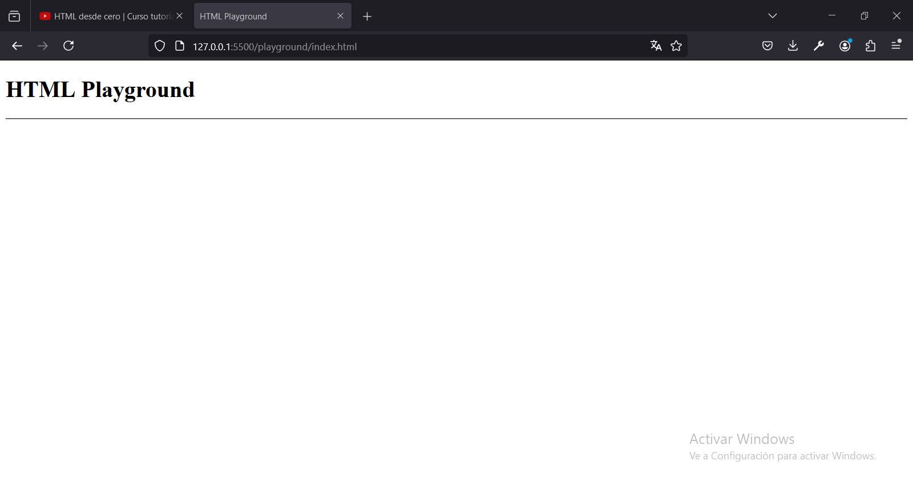

# Capitulo 1: Introducción

## El archivo index.html

El archivo `index.html` es el punto de entrada a la pagina web. En el mismo, se ingresa el código HTML que va a describir la estructura de la misma.

1. Crear una carpeta llamada `playground`.
2. Crear un archivo llamado `index.html` dentro de la carpeta `playground`.

## Elementos

El código HTML esta formado por elementos que pueden contener:

- Otros elementos, es decir, se permite el anidamiento de los mismos.
- Texto.

A continuación, se muestra un elemento que contiene texto:

`<h1 class="titulo">Titulo</h1>`.

El mismo esta compuesto por:

- Una etiqueta de apertura `<h1>`.
- Un atributo `class="titulo"`.
- Un texto `Titulo`.
- Una etiqueta de cierre `</h1>`.

## Crear la estructura básica de elementos anidados

1. Ingresar `html` dentro del archivo `index.html`.
2. Seleccionar `html:5`.

El elemento `<html></html>`, es el elemento raíz de la pagina web.

### Título de la pagina web

1. Ingresar `HTML Playground` como el texto del elemento `<title></title>`.

### Contenido de la pagina web

Dentro del elemento `<body></body>`:

1. Ingresar `<h1>HTML Playground</h1>`.
2. Ingresar `
`.s

## Usar el Live Server

1. Hacer clic derecho sobre `index.html`.
2. Seleccionar `Open with Live Server`.

