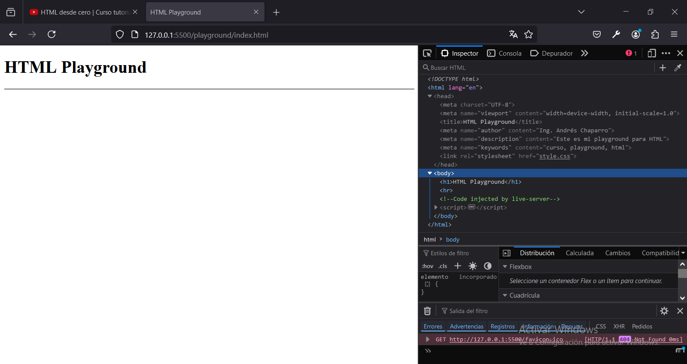
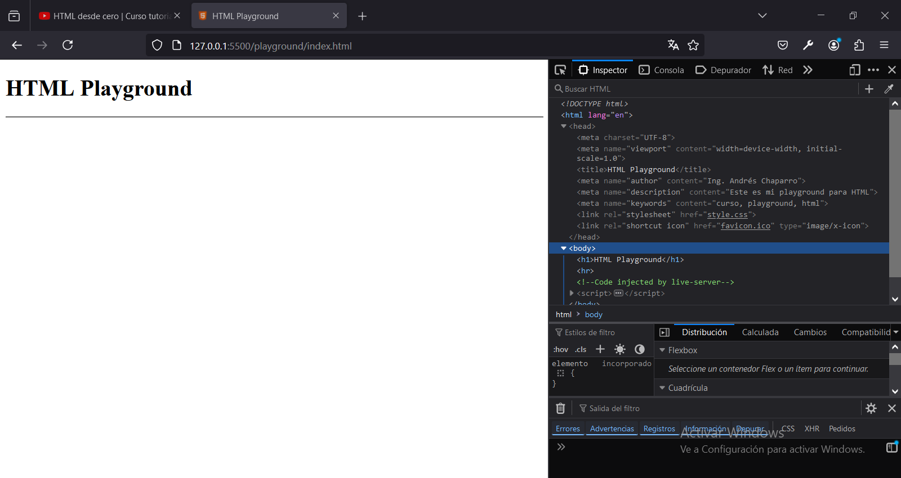

# Capitulo 2: Head

## Metadatos

### Metadatos creados por defecto

- `charset`: indica el juego de caracteres que tendrá la pagina web.
- `viewport`: se usa para indicar el tamaño inicial de los elementos cuando nuestra pagina va a utilizarse en dispositivos móviles.

### Crear un metadato para indicar el autor

1. Agregar `<meta name="author" content="valor" />`.
2. Reemplazar `valor` con nuestro nombre.

### Crear un metadato para indicar una descripción

1. Agregar `<meta name="description" content="texto" />`.
2. Reemplazar `valor` con nuestra descripción.

### Crear un metadato para agregar palabras clave

1. Agregar `<meta name="keywords" content="palabras" />`.
2. Reemplazar `palabras` por nuestras palabras clave separadas por `,`.

Las palabras clave las utilizan los robots de búsqueda para poder encontrar nuestra pagina web.

## Crear un elemento link para agregar una hojas de estilo CSS

1. Crear un archivo llamado `style.css` dentro de la carpeta `playground`.
2. Agregar `<link rel="stylesheet" href="style.css" />`.

## Usar el inspector del navegador para depurar el código HTML

1. Presionar `CTRL+SHIFT+I` cuando estamos viendo la pagina web.

Aparece un error porque nuestra pagina web no tiene un favicon.

## Crear un elemento link para agregar el favicon

1. Descargar un icono de HTML de [ICONS8](https://icons8.com/).
2. Renombrar el archivo como `favicon.ico`.
3. Pegarlo dentro de la carpeta `playground`.
4. Agregar `<link rel="shortcut icon" href="favicon.ico" type="image/x-icon" />`.

El favicon es el icono que va a mostrar el navegador en la pestaña donde tengamos abierta nuestra pagina web.

