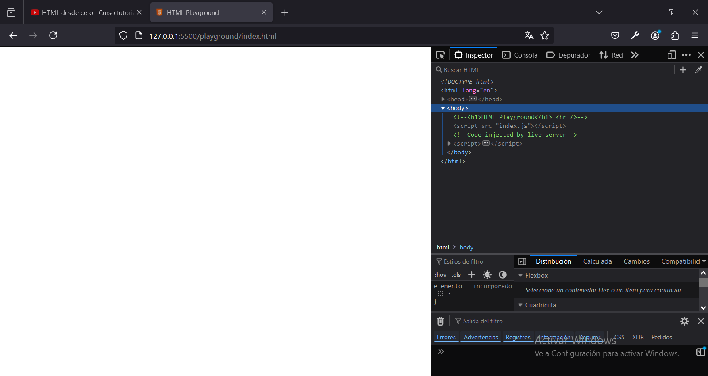
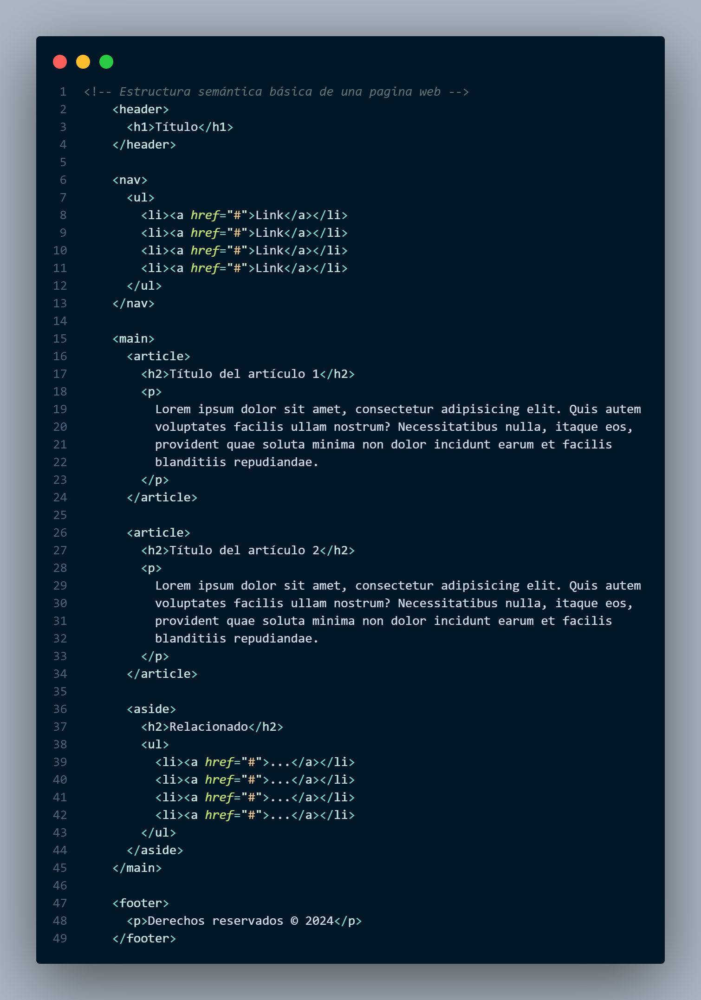
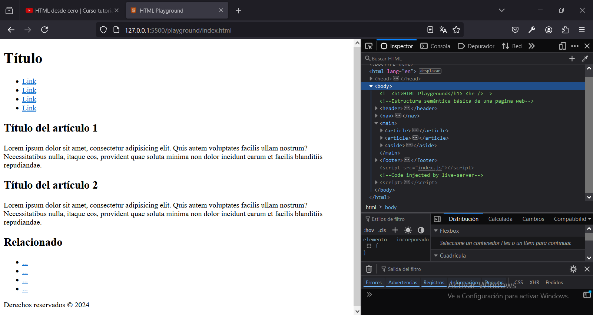

# Capitulo 3: Body

## Crear un elemento script para agregar código JAVASCRIPT

1. Crear un archivo llamado `index.js` dentro de la carpeta `playground`.
2. Agregar `<script src="index.js"></script>` al final del elemento `<body></body>`.

## Comentarios

### Documentar el código

1. Presionar `CTRL+K+C` en una linea en blanco.
2. Ingresar un texto que dentro de `<!--  -->`.

```
    <h1>HTML Playground</h1>
    <hr />
    <!-- Estructura semántica básica de una pagina web -->
```

### Ignorar parte del código

1. Seleccionar la parte del código que no queremos que se ejecute.
2. Presionar `CTRL+K+C`.

```
    <!-- <h1>HTML Playground</h1>
    <hr /> -->
```



### Dejar de ignorar parte del código

1. Seleccionar la parte del código que queremos que vuelva a ejecutarse.
2. Presionar `CTRL+K+U`.

```
    <h1>HTML Playground</h1>
    <hr />
```

## Estructura semántica básica de la pagina web

Los elementos semánticos son utilizados por los motores de búsqueda y mejoran nuestro posicionamiento en la web.





Podemos verificar errores semánticos utilizando la herramienta [Markup Validation Service](https://validator.w3.org/)
