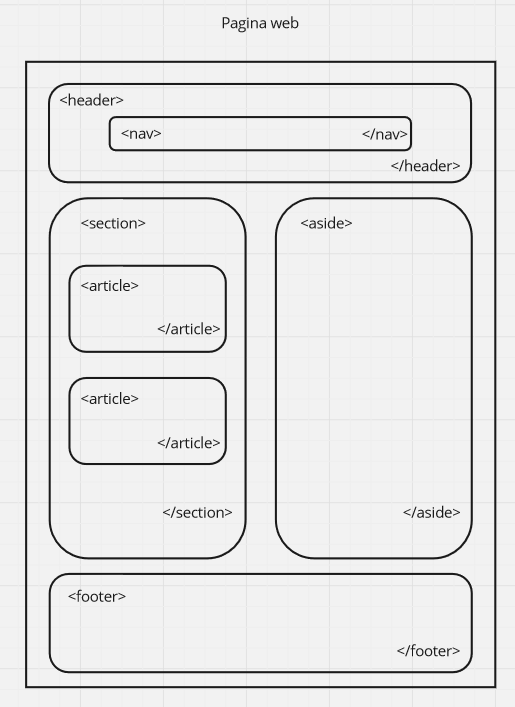

# Capitulo 3: Body

## Javascript

Se utiliza para agregar un archivo Javascript.

1. Agregar ```<script src="index.js"></script>``` al final del elemento ```<body></body>```.
2. Crear un archivo llamado `index.js` dentro de la carpeta `playground`.

## Estructura basica de la pagina web

La plataforma [miro.com](https://miro.com/app/dashboard/) se utiliza para hacer esquemas de como queremos que quede nuestra estructura HTML.



Siempre utilizar los elementos adecuados para estructurar nuestra pagina web. No utilizar solo el elemento ```<div></div>```. Esto, nos permite mejorar el posicionamiento de nuestra pagina web en los buscadores.