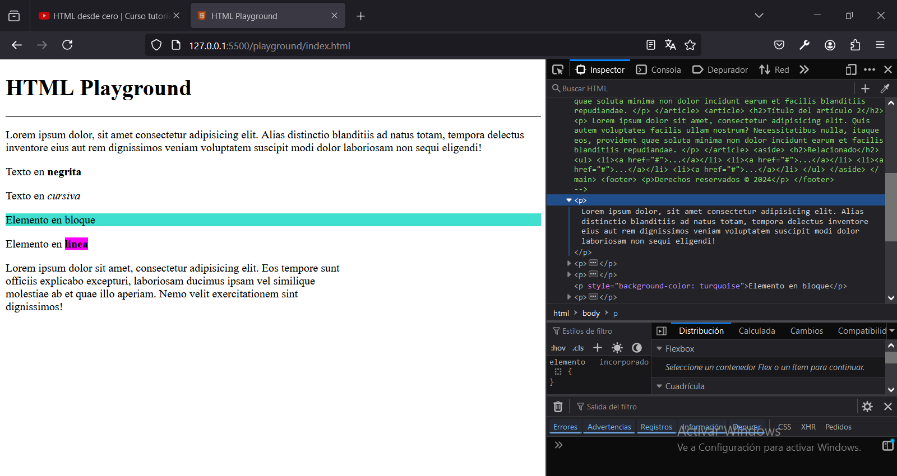

# Capitulo 4: Elementos de texto

## Crear un párrafo

1. Agregar `<p>Texto largo</p>`.
2. Reemplazar `Texto largo` con el texto del párrafo.

Si aun no tenemos el texto, podemos utilizar el `Lorem ipsum`.

```
    <p>
      Lorem ipsum dolor, sit amet consectetur adipisicing elit. Alias distinctio
      blanditiis ad natus totam, tempora delectus inventore eius aut rem
      dignissimos veniam voluptatem suscipit modi dolor laboriosam non sequi
      eligendi!
    </p>
```

## Crear un texto en negrita

1. Agregar `<p>Texto en <b>negrita</b></p>`.
2. Reemplazar `negrita` con el texto que va en negrita.

## Crear un texto en cursiva

1. Agregar `<p>Texto en <i>cursiva</i></p>`.
2. Reemplazar `cursiva` con el texto que va en cursiva.

## Tipos de elementos

### En bloque

Ocupan todo el ancho que puedan ocupar. Como por ejemplo, un párrafo.

1. Agregar `<p style="background-color: turquoise">Elemento en bloque</p>`.

Ademas, ignoran los saltos de linea que tengan dentro de su texto, tal como se vio al utilizar `Lorem ipsum`.

### En linea

Ocupan unicamente el ancho de su contenido. Como por ejemplo, un texto en negrita o cursiva.

1. Agregar `<p>Elemento en <b style="background-color: magenta">linea</b></p>`.

### Sin etiqueta de cierre

- El elemento `<hr />` se utiliza para introducir una linea horizontal, tal como ya se vio.

- El elemento `<br />` se utiliza para introducir un salto de linea, incluso dentro de un elemento en bloque.

1. Agregar:

```
    <p>
      Lorem ipsum dolor sit amet, consectetur adipisicing elit. Eos tempore
      sunt<br />
      officiis explicabo excepturi, laboriosam ducimus ipsam vel similique<br />
      molestiae ab et quae illo aperiam. Nemo velit exercitationem sint<br />
      dignissimos!
    </p>
```



## Crear un texto en negrita del tipo semántico

1. Agregar `<p>Texto <strong>importante</strong></p>`.
2. Reemplazar `importante` con el texto que va en negrita.

## Crear un texto en cursiva del tipo semántico

1. Agregar `<p>Texto <em>enfático</em></p>`.
2. Reemplazar `enfático` con el texto que va en cursiva.

## Crear títulos

Los títulos tienen jerarquía:

- `<h1>Titulo Principal</h1>`.
- `<h2>Titulo Secundario/h2>`.
- `<h3>Otros Títulos</h3>`.
- `<h4>Otros Títulos</h4>`.
- `<h5>Otros Títulos</h5>`.
- `<h6>Otros Títulos</h6>`.

El titulo principal se utiliza una única vez en la pagina web.

El titulo secundario se utiliza para indicar artículos o secciones.

## Crear un párrafo con saltos de linea y/o sangria

1. Agregar:

```
<pre>
    linea 1
    linea 2
    linea 3
    linea 4
</pre>
```

## Crear una cita

1. Agregar:

```
    <p>
      <q cite="https://www.lanacion.com.ar"
        >Locura es hacer la misma cosa una y otra vez esperando obtener
        diferentes resultados.</q
      >Albert Einstein
    </p>
```

2. Agregar:

```
    <p>
      En japones la forma de decir que el tiempo todo lo arregla es:<q
        lang="JA-ja"
        >NANKURUNAISA</q
      >
    </p>
```

Los atributos `cite` y `lang` nos permiten mejorar el posicionamiento de la pagina web.

## Crear un texto con super-indices

1. Agregar:

```
    <p>
      hipotenusa<sup>2</sup> = cateto opuesto<sup>2</sup> + cateto adyacente<sup
        >2</sup
      >
    </p>
```

## Crear un texto con sub-indices

1. Agregar `<p>El agua es: H<sub>2</sub>O</p>`.

## Crear un texto de ayuda para las abreviaturas

1. Agregar:

```
    <p>
      Desde la tierra a la luna hay 384.400 <abbr title="Kilómetros">Kms</abbr>
    </p>
```

El texto de ayuda se muestra en un cuadro emergente, luego de colocar el cursor sobre la abreviatura.

## Crear un enlace

1. Agregar:

```
    <a href="https://www.google.com" target="_blank"
      >Haz clic aquí para ir a google</a
    >
```

El atributo `target="_blank"` abre el enlace en una pestaña, lo que permite que nuestra pagina no se cierre.

Un enlace también se puede utilizar para enviar un mail o llamar por teléfono:

2. Agregar la etiqueta `<a href="mailto:chaparroandres87@gmail.com">Enviar mail</a>`.
3. Agregar la etiqueta `<a href="tel:+591155554444">Llamar por teléfono</a>`.
