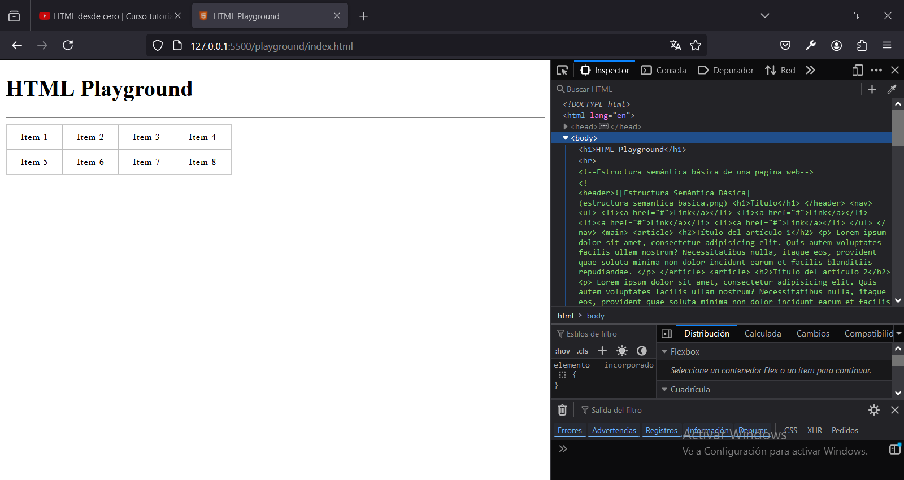
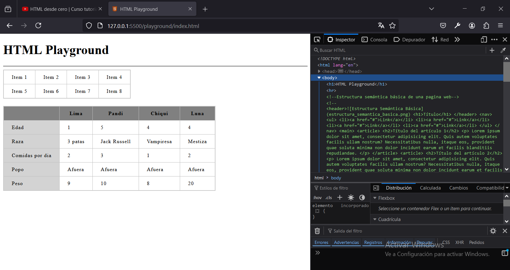

# Capitulo 9: Tablas

## Crear una tabla básica

1. Agregar:

```
    <table>
      <tr>
        <td>Item 1</td>
        <td>Item 2</td>
        <td>Item 3</td>
        <td>Item 4</td>
      </tr>
      <tr>
        <td>Item 5</td>
        <td>Item 6</td>
        <td>Item 7</td>
        <td>Item 8</td>
      </tr>
    </table>
```

- El elemento `<table></table>` nos permite crear la tabla.
- Los elementos `<tr></tr>` nos permiten agregar filas a la tabla.
- Los elementos `<td></td>` nos permiten agregar columnas a una fila.

## Agregar estilos a la tabla

1. Modificar el contenido de `style.css`:

```
table {
    /* Borde exterior de la tabla pegado al borde interior*/
    border-collapse: collapse;
    /* Borde exterior de la tabla de 2 pixeles de color gris */
    border: 2px solid rgb(200, 200, 200);
    /* Separación entre las letras */
    letter-spacing: 1px;
    /* Tamaño de fuente un poco mas chica */
    font-size: 0.8rem;
}
td {
    /* Borde interior de la tabla de 1 pixel de color gris mas oscuro pegado */
    border: 1px solid rgb(190, 190, 190);
    /* Separación interna entre las filas y columnas */
    padding: 10px 20px;
}
th {
    /* Borde interior de la tabla de 1 pixel de color gris mas oscuro pegado */
    border: 1px solid rgb(190, 190, 190);
    /* Separación interna entre las filas y columnas */
    padding: 10px 20px;
    /* El color de fondo es el gris mas oscuro */
    background-color: grey;
}
```



## Crear una tabla avanzada

1. Agregar:

```
    <br />
    <table>
      <colgroup>
        <col style="background-color: lightgrey" />
        <col />
        <col />
        <col />
        <col />
      </colgroup>

      <tr>
        <th>&nbsp;</th>
        <th>Lima</th>
        <th>Pandi</th>
        <th>Chiqui</th>
        <th>Luna</th>
      </tr>

      <tr>
        <td>Edad</td>
        <td>1</td>
        <td>5</td>
        <td>4</td>
        <td>4</td>
      </tr>

      <tr>
        <td>Raza</td>
        <td>3 patas</td>
        <td>Jack Russell</td>
        <td>Vampiresa</td>
        <td>Mestiza</td>
      </tr>

      <tr>
        <td>Comidas por dia</td>
        <td>2</td>
        <td>3</td>
        <td>1</td>
        <td>2</td>
      </tr>

      <tr>
        <td>Popo</td>
        <td>Afuera</td>
        <td>Afuera</td>
        <td>Afuera</td>
        <td>Afuera</td>
      </tr>

      <tr>
        <td>Peso</td>
        <td>9</td>
        <td>10</td>
        <td>8</td>
        <td>20</td>
      </tr>
    </table>
```

- El valor `&nbsp;` se utiliza para dejar el contenido vacío.
- El elemento `<colgroup></colgroup>` mas los elementos `<col>` nos permiten aplicarles estilos diferentes a cada columna.
- Los elementos `<th></th>` se utilizan en lugar de los `<td></td>` para indicar que son etiquetas y nos permiten aplicarles estilos diferentes.


